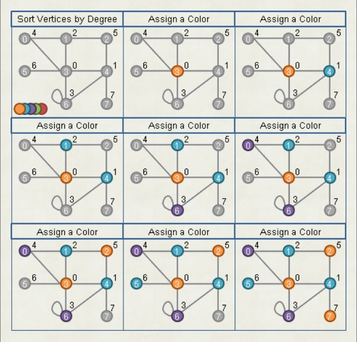

## Grapg coloring 
(自行尋找問題 : WIKI - List of NP-complete problems)

[Coloring](https://web.ntnu.edu.tw/~algo/Coloring.html#1)

### Example
### k-Vertex Coloring
k 點著色 : 使用 k 種顏色完成點著色。 NP-complete 。
特殊圖可推理出最小著色數的上限。
.jpg)

### Greedy Vertex Coloring / Grundy Chromatic Number
```
「貪心點著色」是採用貪心法而得到的點著色，可能有許多種。「 Grundy 著色數」是貪心點著色的顏色數目。不控制著色數。
最小點著色、 k 點著色，都是 NP-complete 問題，沒有快速的演算法。於是有些人轉為討論貪心點著色，設計快速的演算法。
```

###無向圖點著色（ Welsh–Powell Algorithm ）
貪心點著色。圖上每個點，依照邊數由大到小排序，依序塗色。針對一個點，依序嘗試各種顏色，直到不牴觸已塗色的點。
每個點的邊數是 0 到 V-1 （不考慮多重的邊、不考慮自己連向自己的邊），排序可以採用 Counting Sort ，時間複雜度 O(V) 。
時間複雜度等於一次 Graph Traversal 的時間。圖的資料結構為 Adjacency Matrix 是 O(V²) ，圖的資料結構為 Adjacency Lists 是 O(V+E) 。
